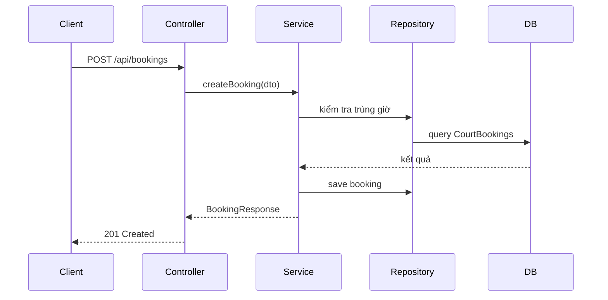

# Kiến trúc hệ thống - ShopBadminton

Backend áp dụng Clean Architecture: `Entity → Repository → Service → Controller` (lớp trong không phụ thuộc lớp ngoài).

## Vai trò các lớp

| Lớp | Vai trò |
|---|---|
| Entity | Ánh xạ bảng SQL Server |
| Repository | Truy vấn DB (kế thừa JpaRepository) |
| Service | Logic nghiệp vụ |
| Controller | Nhận request, validate, gọi Service, trả response |
| DTO | Trung gian giữa Controller và client |
| Mapper | Chuyển đổi Entity ↔ DTO |
| Exception | Xử lý lỗi tập trung |
| Security | JWT auth/phân quyền |

## Luồng xử lý ví dụ: Đặt sân

## Vì sao tách lớp

- Dễ test (mock Service khi test Controller)
- Đổi DB không ảnh hưởng logic nghiệp vụ
- Dễ maintain dự án dài ngày, dễ định vị code cần sửa