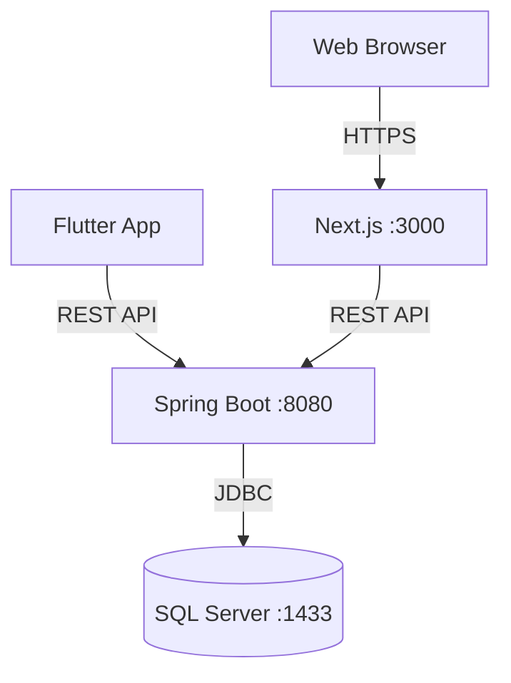

# Deployment Diagram - ShopBadminton

## Port local

| Thành phần | Port |
|---|---|
| Backend | 8080 |
| Web | 3000 |
| SQL Server | 1433 |

⚠️ Android Emulator gọi API qua `10.0.2.2:8080`, không dùng `localhost`.